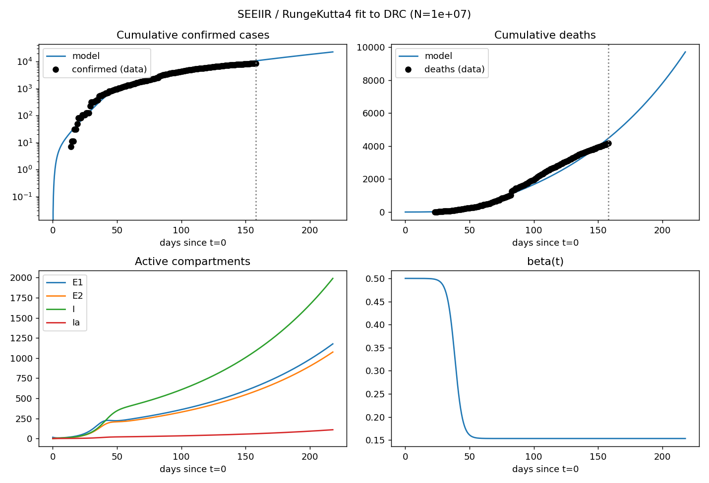

# SEEIIR Ebola Outbreak Model — DRC / Uganda 2026

A from-scratch numerical toolkit for epidemiological modelling, applied to the
2026 Bundibugyo Ebola outbreak in the Democratic Republic of the Congo and
Uganda. The project couples a hand-written Runge–Kutta 4 ODE solver with a
SEEIIR compartmental model, fits the model to cumulative confirmed cases and
deaths, and produces a four-panel diagnostic figure.

No SciPy ODE solver is used — the numerics are transparent, inspectable, and
written to be read. The full pipeline runs end-to-end from a public data
source: **fetch → clean → fit → plot**.

---

## Table of contents

1. [What this is](#what-this-is)
2. [Pipeline](#pipeline)
3. [The model](#the-model)
4. [The solver](#the-solver)
5. [Data](#data)
6. [Installation](#installation)
7. [Usage](#usage)
8. [Output](#output)
9. [Project layout](#project-layout)
10. [Fitting procedure](#fitting-procedure)
11. [Design notes](#design-notes)
12. [Limitations](#limitations)
13. [Roadmap](#roadmap)
14. [References](#references)
15. [License](#license)

---

## What this is

A small, self-contained Python project that:

1. **Fetches** the latest surveillance data from a public GitHub tracker
   (INSP situation reports compiled by a third party), with an ECDC page
   cross-check.
2. **Cleans** the raw data: fills missing calendar days by forward-fill
   (correct for cumulative counts), normalizes column names, and enforces
   monotonicity.
3. **Models** the outbreak with a SEEIIR compartmental structure that has
   two asymptomatic / pre-symptomatic infectious compartments, so the
   epidemiology of Bundibugyo virus is represented faithfully.
4. **Solves** the model with a hand-written `RungeKutta4` implemented as a
   subclass of a general `ODESolver` base class.
5. **Fits** five parameters to cumulative confirmed cases and deaths by
   least squares on a log scale.
6. **Plots** a four-panel diagnostic: cases, deaths, active compartments,
   and the fitted `beta(t)`.

The point of the project is not to produce a policy-grade forecast — it is
to demonstrate, on a real outbreak, that a small, clearly written ODE solver
plus a structured model class is enough to do meaningful epidemic modelling.

---

## Pipeline
